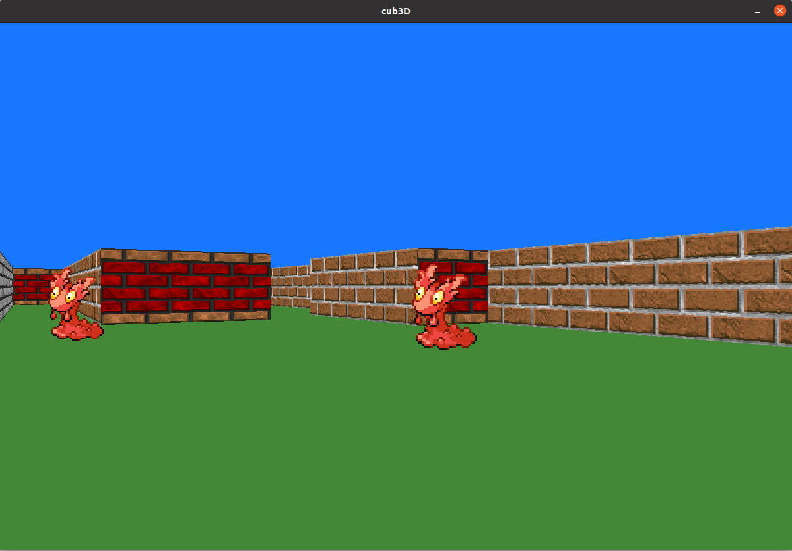
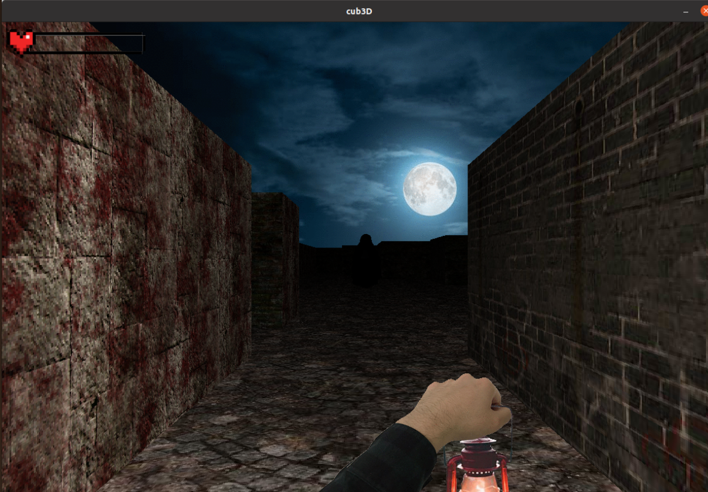

# cub3D :black_square_button:
This project is inspired by the world-famous eponymous 90’s game, which was the first FPS ever. The goal will be to
find your game inside a maze.

## A bit of history :book:
Developed by Id Software by the über famous John Carmack and John Romero, published in 1992 by Apogee Software, Wolfenstein 3D is the first true “First Person
Shooter” in the history of video games.

Wolfenstein 3D is the ancestor of games like Doom (Id Software, 1993), Doom II
(Id Software, 1994), Duke Nukem 3D (3D Realm, 1996) and Quake (Id Software, 1996),
that are additional eternal milestones in the world of video games.
If you want to know more :arrow_right: [Wolfenstein 3D](https://es.wikipedia.org/wiki/Wolfenstein_3D)

## Pre-requisites :exclamation:
- [x] Linux OS
- [x] GCC Compiler

## Installation :rocket:
1. `git clone https://www.github.com/MikelTolino/Cub3D.git`
2. `make` or `make bonus`
3. `./cub3D maps/mandatory.cub` or  `./cub3D maps/bonus.cub`

Based on your `make` choice, you should use one map or another.

## Controllers :bomb:

- W A S D :arrow_forward: to move through the map
- :arrow_left: :o: :arrow_right: to rotate the camera

## Screenshots :mag:
### Mandatory :boom:

___
### Bonus :star:

### Resources :book:
+ [Permadi Raycasting Tutorial](https://permadi.com/1996/05/ray-casting-tutorial-table-of-contents/)
+ [Minilibx Info](https://qst0.github.io/ft_libgfx/)
+ [Lodev Raycasting Tutorial](https://lodev.org/cgtutor/raycasting.html) :star:
+ [Creating BMP Images](http://ricardolovelace.com/creating-bitmap-images-with-c-on-windows.html)

